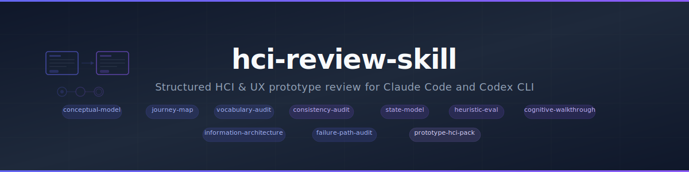

# hci-review-skill

<p align="center">
  
</p>

<p align="center">
  
</p>

<p align="center">
  <a href="LICENSE"></a>
  
  
  
</p>

A structured HCI and UX review skill pack for prototypes, flows, and interface systems. It focuses on models, journeys, terminology, state handling, consistency, failure paths, heuristics, and cognitive walkthroughs.

## Included skills

### Core review skills

- `prototype-hci-pack`
- `conceptual-model`
- `state-model`
- `journey-map`
- `vocabulary-audit`
- `information-architecture`
- `consistency-audit`
- `failure-path-audit`
- `heuristic-eval`
- `cognitive-walkthrough`

### Beads variants

- `prototype-hci-pack-beads`
- `conceptual-model-beads`
- `state-model-beads`
- `journey-map-beads`
- `vocabulary-audit-beads`
- `information-architecture-beads`
- `consistency-audit-beads`
- `failure-path-audit-beads`
- `heuristic-eval-beads`
- `cognitive-walkthrough-beads`

## Features

- Reviews real interfaces as systems, not isolated screens
- Produces durable markdown artifacts under `docs/hci/`
- Includes diagrams, scorecards, summaries, and structured review outputs
- Ships both core review skills and Beads-backed issue-generation variants
- Mirrors packaged skills into both `.claude/skills/` and `.agents/skills/`

## Install

### Option A: Install globally

```bash
git clone https://github.com/45ck/hci-review-skill.git
cd hci-review-skill
bash install.sh
```

This installs every packaged skill into both:

- `~/.claude/skills/`
- `~/.agents/skills/`

### Option B: Copy into a project

```bash
cp -R .claude /path/to/your-project/
cp -R .agents /path/to/your-project/
```

### Uninstall

```bash
bash uninstall.sh
```

## Usage

```text
/prototype-hci-pack onboarding flow
/conceptual-model approval system
/state-model request lifecycle
/journey-map first-time user onboarding
/vocabulary-audit approval + request + task terminology
/information-architecture main navigation and settings
/consistency-audit settings, approvals, and notifications
/failure-path-audit checkout flow
/heuristic-eval approval dashboard
/cognitive-walkthrough create-new-agent flow

/heuristic-eval-beads approval dashboard
/prototype-hci-pack-beads onboarding flow
```

## Repo structure

```text
.claude/skills/<skill>/SKILL.md      packaged skill format
.agents/skills/<skill>/SKILL.md      mirrored packaged skill format
docs/hci/                            templates and generated review artifacts
install.sh                           global installer
uninstall.sh                         global uninstaller
LICENSE                              MIT
```

## Related skill packs

- [business-analysis-skills](https://github.com/45ck/business-analysis-skills) - Business analysis techniques, workflows, and quality checks
- [marketing-product-skills](https://github.com/45ck/marketing-product-skills) - Product strategy, growth, positioning, launch, SEO, and pricing skills
- [fagan-inspection-skill](https://github.com/45ck/fagan-inspection-skill) - Formal inspection and defect-review skills for code changes

## License

[MIT](LICENSE)
