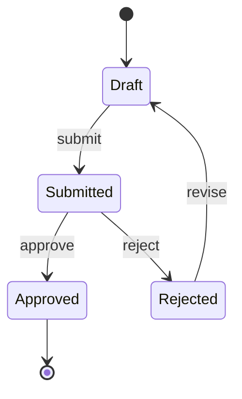

# State Model: [System/Feature Name]

> Generated by `/state-model`

## Entities

### [Entity Name]

#### States
| State | Meaning | User-visible cue | Entry condition | Exit condition |
|-------|---------|-------------------|-----------------|----------------|
|       |         |                   |                 |                |

#### Allowed transitions
| From | To | Trigger | Who can trigger | Side effects |
|------|-----|---------|----------------|--------------|
|      |     |         |                |              |

#### Invalid transitions
| From | To | Why invalid | What happens if attempted |
|------|-----|------------|--------------------------|
|      |     |            |                          |

#### State diagram

---

### [Entity Name 2]
<!-- Repeat structure above -->

---

## Cross-entity dependencies
<!-- Where one entity's state depends on another's -->

## UI state coverage

| Entity | State | Has visual cue | Has available actions | Has transition feedback | Gap |
|--------|-------|---------------|----------------------|------------------------|-----|
|        |       |               |                      |                        |     |

## Synthesis
<!-- Ambiguous states, silent transitions, missing cues, simplification opportunities -->
